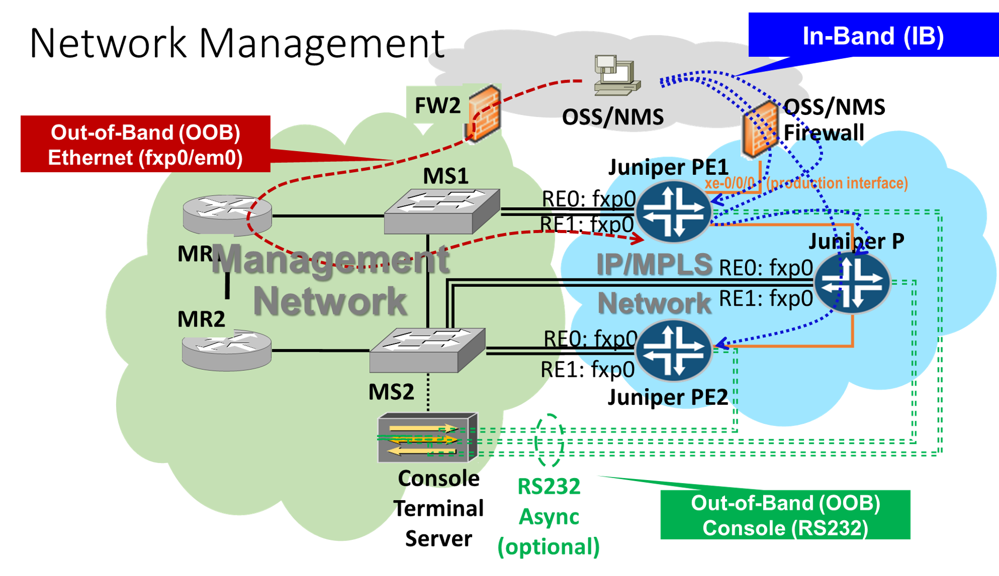

# MANGEMENT TRAFFIC IN A NON-DEFAULT ROUTING INSTANCE

## Options

1. [Fake management VRF - with route leaking](#fake) - see sample [VMM configuration](fake-mgmt-vrf)
2. [Routing instance **mgmt_junos**](#mgmt_junos) - see sample [VMM configurations](mgmt_junos)
3. [Routing instance **mgmt_junos** - with route leaking into inet.0](#mgmt_junos_inet0) - VMM configurations same as previous.

## Applicability Matrix

Depending on your Junos OS Release and router management method (in-band/out-of-band), you should go for the following options:

| **Junos OS Release**  | **IN-BAND**   |   **OUT-OF-BAND**      |
|:----------------------|:-------------:|:----------------------:|
|  Older than 17.3R1    |  [1](#fake)   |  N/A (inet.0 only)     |
|  17.3R1 up to 17.4R3  |  [1](#fake)   | [3](#mgmt_junos_inet0) |
|  18.1R1 or newer      |  [1](#fake)   | [2](#mgmt_junos)       |

<a name="fake">
## 1. Fake Management VRF - with Route Leaking
</a>

The customer has a VRF for management (here we call it MGMT) spreading all over their network.
Management traffic from BSS/OSS/NMS to the routers and back flows via the VRF MGMT.
The routers are not managed OOB (so, fxp0 interfaces are not relevant).
We want to allow IN-BAND management via VRF MGMT.

### Principle

* We define routing-instance MGMT on the router - standard VRF configuration:
<pre>
    routing-instances {
        MGMT {
            instance-type vrf;
            interface lo0.1;                  ### VRF-specific loopback
            route-distinguisher 100.0.0.1:1;
            vrf-import PL-MGMT-IMPORT;
            vrf-export PL-MGMT-EXPORT;
            vrf-table-label;
        }
    }
</pre>

* Set the lo0.1 address to be identical to lo0.0 - e.g.:
<pre>
    interfaces {
        lo0 {
            unit 0 {
                family inet {
                    address 100.0.0.3/32;
                }
            }
            unit 1 {
                family inet {
                    address 100.0.0.3/32;
                }
            }
        }
    }
</pre>

* In [edit routing-options] - we need to let the router know that BSS/OSS/NMS is within VRF MGMT, so NTP/SNMP/TACACS+ etc. responses go into VRF MGMT.
  For that part we need to use the [**next-table**](https://www.juniper.net/documentation/en_US/junos/topics/reference/configuration-statement/static-edit-routing-options.html)
  knob at the **[edit routing-options static route <\*>]** configuration level:
<pre>
    routing-options {
        static {
            route 100.0.1.0/24 next-table MGMT.inet.0; ### BSS/OSS/NMS range
        }
    }
</pre>

* BSS/OSS/NMS - is connected on the "noc" router, to ge-0/0/2 (in this demo - Linux server)
* No special additions required on the "noc" router, this works out-of-the-box.

**Effect:** Management traffic comes via the **MGMT** routing instance, where it hits the **lo0.1** loopback.
This traffic is then passed towards the appropriate target daemon on the router (e.g. snmpd, ntpd etc.).
The daemon receives the incoming messages and sends the responses back. However, since daemons operate at the
underlying FreeBSD level, they are not VRF aware, so they send the traffic back using the default **inet**
routing table. However, in the **inet** routing table, in the next-hop options, [next-table](https://www.juniper.net/documentation/en_US/junos/topics/reference/configuration-statement/static-edit-routing-options.html)
knob is present pointing to the **MGMT.inet.0** routing table, so the management traffic from the router towards the BSS/OSS/NMS servers will be redirected to
the **MGMT** routing instance.

### Services Tested

* NTP
* DNS
* TACACS+
* SYSLOG
* SNMP (gives the full access to all MIBs!)

<a name="mgmt_junos">
## 2. Routing Instance **mgmt_junos**
</a>

Starting with Junos OS Release 17.3R1, you can confine the management interface in a nondefault virtual routing and forwarding (VRF) instance, the mgmt_junos routing instance.
More information is available on the relevant <a href="https://www.juniper.net/documentation/en_US/junos/topics/topic-map/management-interface-in-non-default-instance.html">Junos OS Documentation page</a>.
Although this feature was introduced in Junos 17.3R1, none of the services was VRF-aware in that release, so in that case
an additional step is required for services not operating within the **mgmt_junos** routing instance.
Similar to the [fake management VRF](#fake) use case, we need to use the [**next-table**](https://www.juniper.net/documentation/en_US/junos/topics/reference/configuration-statement/static-edit-routing-options.html) knob
at the **[edit routing-options static route <\*>]** configuration level, to leak various BSS/OSS/NMS routes from **mgmt_junos.inet.0** into **inet.0**.
This option should be applied after all steps described in this chapter are applied. More information about this can be found [here](#mgmt_junos_inet0).

### Principle

Junos OS offers a hardcoded routing instance **mgmt_junos** for management traffic, which is activated by using the
**management-instance** knob at the **[edit system]** configuration level. Once configured, **DO NOT COMMIT IMMEDIATELY**,
but follow strictly the instructions provided in the <a href="https://www.juniper.net/documentation/en_US/junos/topics/topic-map/management-interface-in-non-default-instance.html">Junos OS Documentation</a>:
Otherwise, you'll be cut off from the remote session and the only way to get back into the router will be from the
same LAN segment where fxp0 interface is connected to, or via the serial console port.

* Activate the knob (**DO NOT COMMIT YET!**):

<pre>
    [edit]
    user@host# set system management-instance
</pre>

* Make a list of all static routes:

<pre>
    user@host&gt; show configuration routing-options static | display set relative
</pre>

* You will get the output in the form:

<pre>
    set route 172.16.0.0/12 next-hop 10.102.175.254
    set route 172.16.0.0/12 retain
    set route 172.16.0.0/12 no-readvertise
    set route 10.0.0.0/8 next-hop 10.102.175.254
    set route 10.0.0.0/8 retain
    set route 10.0.0.0/8 no-readvertise
    set route 66.129.255.62/32 next-hop 10.102.175.254
    set route 66.129.255.62/32 retain
    set route 66.129.255.62/32 no-readvertise
</pre>

* Select only routes having the next-hop on the network where **fxp0** is connected and configure them in the **mgmt_junos** routing instance:

<pre>
    edit routing-instances mgmt_junos routing-options static
    set route 172.16.0.0/12 next-hop 10.102.175.254
    set route 172.16.0.0/12 retain
    set route 172.16.0.0/12 no-readvertise
    set route 10.0.0.0/8 next-hop 10.102.175.254
    set route 10.0.0.0/8 retain
    set route 10.0.0.0/8 no-readvertise
    set route 66.129.255.62/32 next-hop 10.102.175.254
    set route 66.129.255.62/32 retain
    set route 66.129.255.62/32 no-readvertise
</pre>

* Remove those same static routes from the master routing instance:

<pre>
    edit routing-options static
    delete route 172.16.0.0/12
    delete route 10.0.0.0/8
    delete route 66.129.255.62/32
</pre>

* Now, **COMMIT** the configuration and you're done:

<pre>
    commit and-quit
</pre>

You will lose remote access to the router, but that's only tempoprary.
If everything was done fine, you will be able to login into the router again.

### Services Tested

| **Service**                    | **Minimum Junos OS Relase** |
|--------------------------------|-----------------------------|
| Automation Scripts             | 18.1R1                      |
| BGP Moniotoring Protocol (BMP) | 18.3R1                      |
| NTP                            | 18.1R1                      |
| RADIUS                         | 18.1R1                      |
| TACACS+                        | 17.4R1                      |
| SYSLOG                         | 18.4R1                      |
| DNS                            | 18.4R1                      |

For services not working within **mgmt_junos** routing instance, use [route leaking into inet.0](#mgmt_junos_inet0) option.

<a name="mgmt_junos_inet0">
## 3. Routing Instance **mgmt_junos** - with Route Leaking into inet.0
</a>

This option is implemented in two stages:

* First, implement the [routing instance **mgmt_junos**](#mgmt_junos), according to the instructions provided in the [previous chapter](#mgmt_junos).
* Secondly, for any service not being capable of working within the **mgmt_junos** routing instance, add a static route in **inet.0** with the
  [**next-table**](https://www.juniper.net/documentation/en_US/junos/topics/reference/configuration-statement/static-edit-routing-options.html) knob pointing to
  the **mgmt_junos** routing instance - e.g.:

<pre>
    routing-options {
        static {
            route 100.0.1.3/32 next-table mgmt_junos.inet.0; ### VRF-unaware service (e.g. DNS)
        }
    }
</pre>

